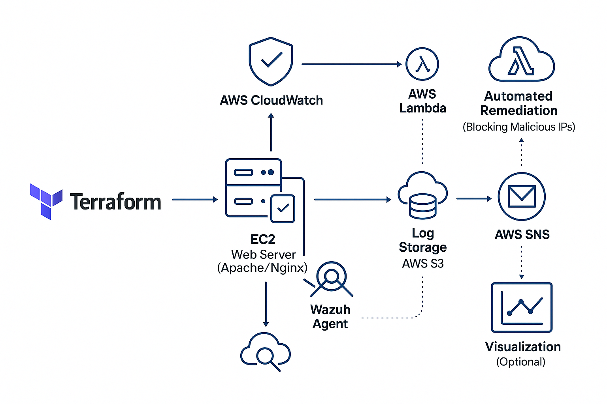

# Cloud-based Threat Detection & Alerting System (CTDAS)


This project simulates a real-world cloud security solution for detecting and responding to brute-force attacks using AWS infrastructure, SIEM monitoring, and automation tools. It uses Terraform for infrastructure provisioning, Python for threat detection, and AWS Lambda for automated remediation.

---

## 🔐 Features
- Detects SSH brute-force attempts
- Sends real-time alerts via AWS SNS
- Automatically blocks malicious IPs using Lambda
- Infrastructure-as-Code with Terraform
- Log monitoring with Wazuh SIEM agent
- CI pipeline via GitHub Actions

---

## 🧭 System Architecture


---

## ⚙️ Setup Instructions

### 1. Clone the Repo

```bash
git clone https://github.com/sanjana92/Cloud-Based-Threat-Detection-Alerting-System.git
cd Cloud-Based-Threat-Detection-Alerting-System
```

### 2. Deploy Infrastructure

```bash
cd terraform
terraform init
terraform apply
```

### 3. Configure EC2

SSH into your EC2 and run:
```bash
bash scripts/setup.sh
```

### 4. Enable Monitoring

```bash
crontab -e
# Add this line to run every 5 minutes
*/5 * * * * /usr/bin/python3 /home/ubuntu/scripts/alert_monitor.py >> /var/log/monitor.log 2>&1
```

---

## 📦 Project Structure

```
.
├── terraform/           # AWS IaC scripts
├── scripts/             # Setup & alerting scripts
├── lambda/              # IP blocking automation
├── assets/              # Architecture image
├── .github/workflows/   # CI pipeline
└── README.md
```

---

## 🧠 Technologies Used
- AWS (EC2, S3, SNS, Lambda)
- Terraform
- Python
- Bash
- Wazuh (SIEM)
- GitHub Actions

---

## 📬 Example Alert

> 🚨 Brute Force Detected  
> IP: `203.0.113.55` attempted 8 failed logins  
> ✅ Action: Blocked via AWS Lambda

---

## 🤝 Contributing
Pull requests are welcome. Feel free to fork the repo and open issues for suggestions or bugs.

---

## 📝 License
This project is licensed under the MIT License.
